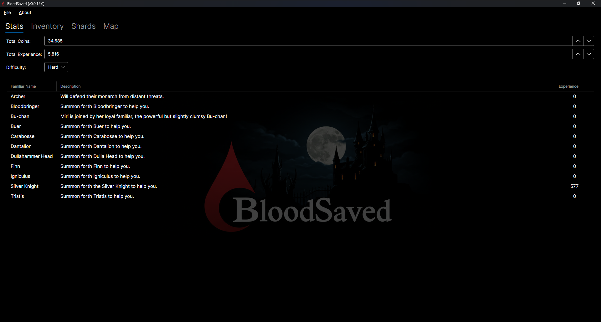
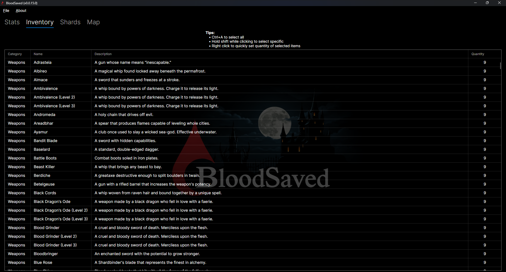
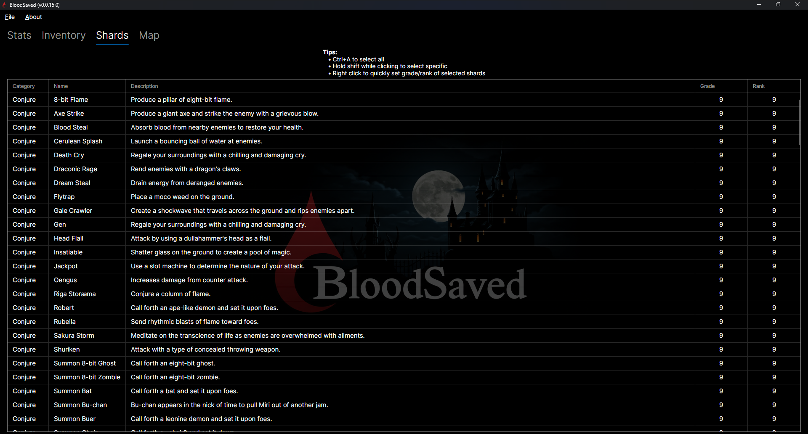
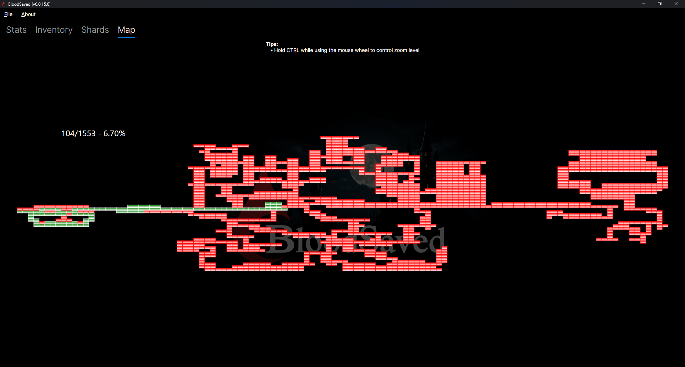

BloodSaved (Bloodstained Save Editor) - A save game editor for Bloodstained: Ritual of the Night.  

## 📖 About 

BloodSaved is currently in an early status but it already has the ability to inject 100% of the items (books, keys, weapons, etc), shards (including skill shards), modify familiar experience and view map progression.  BloodSaved is using Avalonia UI for the user interface implementation.

I have tested the saves produced by the game on PS4 and PC (GOG) versions of Bloodstained.

## Screenshots

## License

BloodSaved is licensed under the [MIT licence](license.md).
