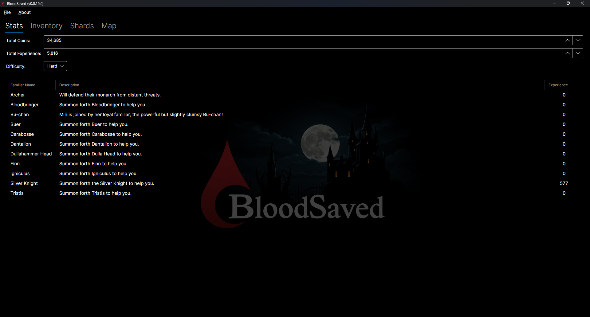
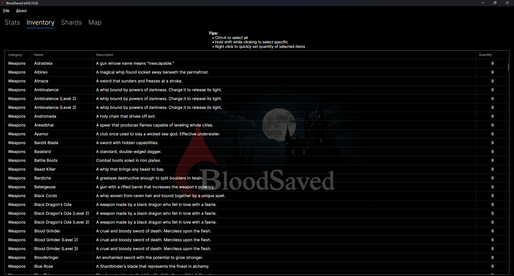
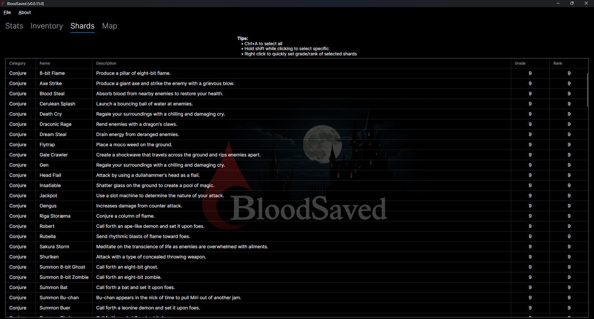
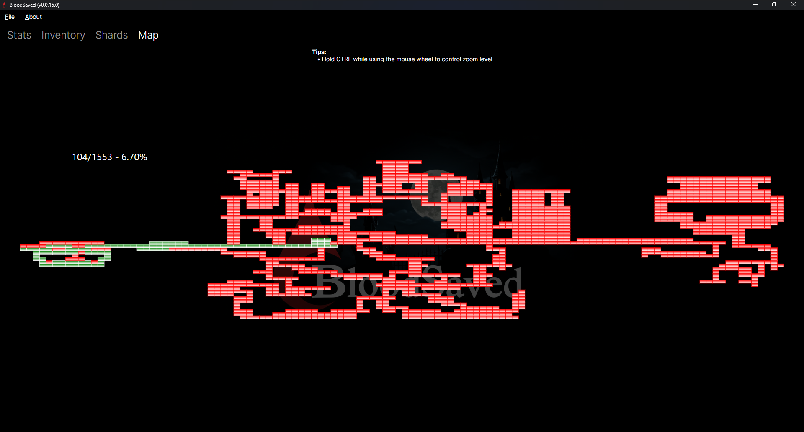

BloodSaved (Bloodstained Save Editor) — a save game editor for [Bloodstained: Ritual of the Night](https://store.steampowered.com/app/692850/Bloodstained_Ritual_of_the_Night/).

## 📖 About

BloodSaved is still early in development, but it already supports editing most of the useful story-save data:

- 📊 **Stats** — total coins, total experience, difficulty (Normal / Hard / Nightmare), and familiar experience
- 🎒 **Inventory** — set quantities for items across all categories (weapons, gear, food, materials, books, keys, etc.)
- 💎 **Shards** — set shard grade and rank, including skill shards
- 🗺️ **Map** — view map progression, zoom and pan, and export the map as an SVG file

You can inject Aurora's familiars and shards into Miriam's save if you want to experiment. Shard grade and rank can be pushed up to 9999, though that tends to make combat trivial.

The UI is built with [Avalonia](https://avaloniaui.net/) 12. Save parsing lives in a separate `BloodSaved.Parsing` library, with round-trip tests in `BloodSaved.Parsing.Tests`.

Saves from the PC (Steam / GOG) and PS4 versions have been tested. PS4 saves were exported with Apollo or Save Wizard before editing.

## ⬇️ Download

Pre-built releases are published on GitHub:

https://github.com/jeromydean/bloodsaved/releases

## 🎮 Usage

1. Open a **story** save file (`Story_Slot*.sav`). System saves and classic-mode variants are not supported.
2. Edit values on the Stats, Inventory, Shards, or Map tabs.
3. Use **File → Save** to write changes back to the same file, or **File → Save As** to choose a new file name and save an encrypted or decrypted copy.

### 💾 Save file locations (PC)

| Platform | Path |
| --- | --- |
| Steam / GOG | `%LOCALAPPDATA%\BloodstainedRotN\Saved\SaveGames\` |
| Xbox Game Pass | `%LOCALAPPDATA%\Packages\505GAMESS.P.A.BloodstainedRitualoftheNightPCGP_tefn33qh9azfc\LocalCache\Local\BloodstainedRotN\Saved\SaveGames\` |

Back up your save before editing.

### 💡 Tips

- On the Inventory and Shards tabs, use Ctrl+A to select all rows, Shift+click for multi-select, and right-click to set quantity, grade, or rank on the selection.
- On the Map tab, Ctrl+mouse wheel zooms, click-and-drag pans, and right-click exports the map as SVG.
- Food first-time consumption bonuses are preserved when you edit other values and save.

## 🛠️ Build from source

Requires the [.NET 10 SDK](https://dotnet.microsoft.com/download).

```bash
git clone https://github.com/jeromydean/bloodsaved.git
cd bloodsaved/src
dotnet build BloodSaved.sln
dotnet run --project BloodSaved/BloodSaved.csproj
```

To run the parsing tests:

```bash
dotnet test BloodSaved.Parsing.Tests/BloodSaved.Parsing.Tests.csproj
```

## 📸 Screenshots






## 📜 License

BloodSaved is licensed under the [MIT License](license.md).
